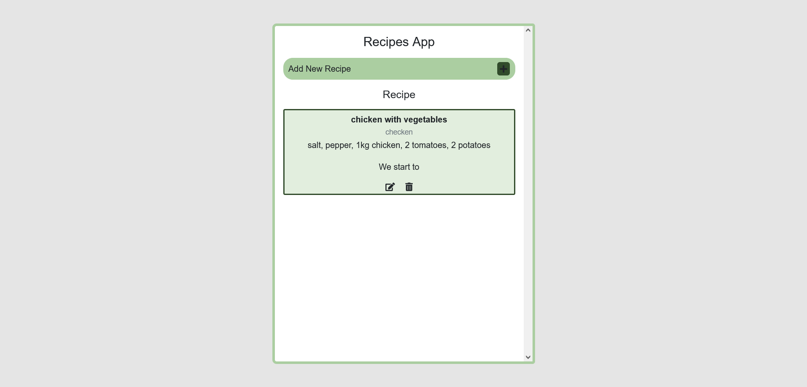

#Recipe Book App

## Table of contents

- [Overview](#overview)
  - [The challenge](#the-challenge)
  - [Links](#links)
- [My process](#my-process)
  - [Built with](#built-with)
  - [What I learned](#what-i-learned)
  - [Continued development](#continued-development)
  - [Useful resources](#useful-resources)
- [Author](#author)

## Overview

### The challenge
One of my aunts wanted a recipe book app to write her recipes. 

### Links

- Solution URL: (https://github.com/stathislag/recipeApp)
- Live Site URL: (https://stathislag.github.io/recipeApp/)

## My process

### Built with

- HTML5 
- CSS 
- Flexbox
- Media Queries
- Bootstrap 5
- Javascript

### What I learned

Some of my major learnings while working through this project. My project structured with Html, Css, Javascript and Bootstrap 5. New consepts  is how to
write a form with Bootstrap and combine the framework of Css with Javascript.

### Continued development

In future projects i would like to learn more consepts about Javascript Framework like React and try out new techniques with Javascript.

### Useful resources
This helped me with the building process and answered all my questions:
- [Resource 1](https://developer.mozilla.org/).
- [Resource 2](https://www.w3schools.com/).
- [Resource 3](https://www.youtube.com).
- [Resource 4](https://www.stackoverflow.com).
- [Resource 5](https://www.freecodecamp.org).
- [Resource 6](https://getbootstrap.com/docs/5.0/getting-started/introduction/).

## Author

- Website - [Stathis](https://github.com/stathislag)

